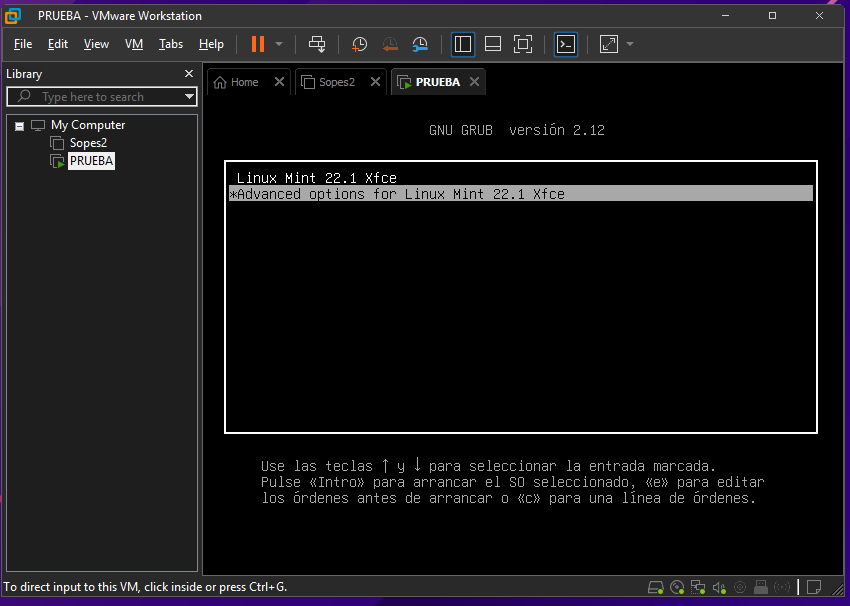
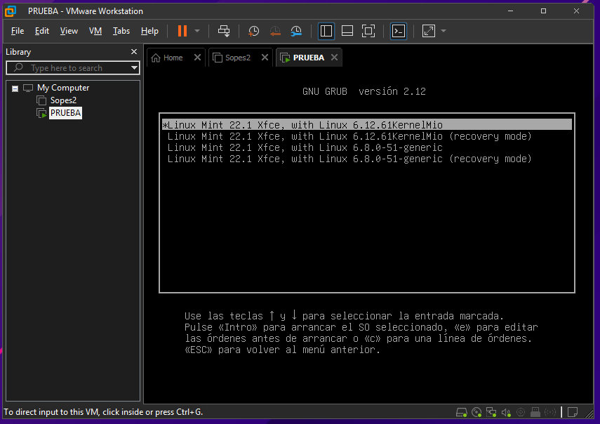

# Guía de Compilación del Kernel Linux

## 📦 Dependencias necesarias

```bash
sudo apt install build-essential libncurses-dev bison flex libssl-dev libelf-dev fakeroot dwarves
```

---

## 📁 Preparación del código fuente

```bash
tar -xvf Linux.xxx
```

### ✏️ Modificar el Makefile

Editar el archivo Makefile y ajustar la línea:

```bash
EXTRAVERSION = HOLA A TODOS
```

---

## 🔧 Copiar configuración actual del kernel

```bash
cp -v /boot/config-$(uname -r) .config
```

### Generar configuración basada en módulos actuales

```bash
make localmodconfig
```

### Deshabilitar claves (opcional para evitar errores de firma)

```bash
scripts/config --disable SYSTEM_TRUSTED_KEYS
scripts/config --disable SYSTEM_REVOCATION_KEYS
scripts/config --set-str CONFIG_SYSTEM_TRUSTED_KEYS ""
scripts/config --set-str CONFIG_SYSTEM_REVOCATION_KEYS ""
```

---

## 🏗️ Compilación del Kernel

> Reemplaza `#nucleos` por el número de hilos/cores de tu CPU

```bash
fakeroot make -j#nucleos
```

### Instalar módulos

```bash
sudo make modules_install
```

### Instalar el kernel

```bash
sudo make install
```

---

## 🖥️ Configuración de GRUB

```bash
cd /etc/default
sudo nano grub
```

Modificar las siguientes líneas en el archivo de grub, por defecto tiene esto valores:

```bash
GRUB_DEFAULT=0
GRUB_TIMEOUT_STYLE=hidden
GRUB_TIMEOUT=0
```

Modificamos con los siguientes valores:

```bash
GRUB_DEFAULT=save
GRUB_TIMEOUT_STYLE=menu
GRUB_TIMEOUT=10
```

Guardar con:

```
Ctrl + O
Ctrl + X
```

### Actualizar GRUB

```bash
sudo update-grub
```

### Reiniciar

```bash
sudo reboot
```

### Seleccionar kernel compilado

Aunque no se muestre el Kernel instalado no quiere decir que algo haya salido mal, ya que al iniciar el SO podemos ingresar a las opciones avanzadas presionando "shift+esc" el cual nos despliega el grub y ahi podemos seleccionar el la version de Kernel instalada, tambien se puede evitar hacer este proceso modificando archivos dentro de SO.



